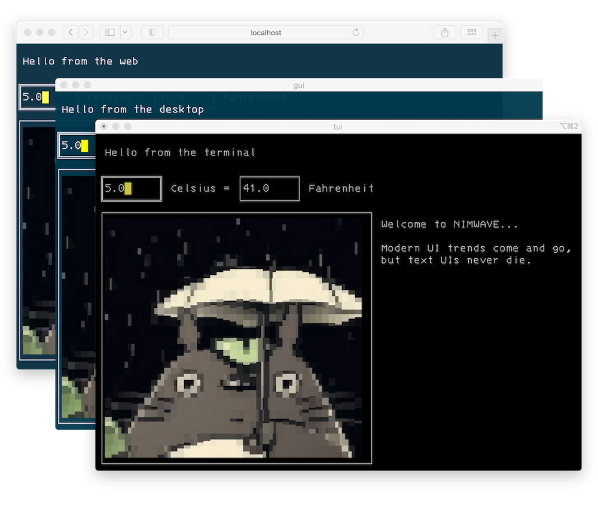

With NIMWAVE, you can build TUI programs for the terminal, the desktop (via OpenGL/GLFW) and the web (via web assembly). Pedantic nerds love to point out that TUI stands for *text* user interface, not terminal. NIMWAVE is what happens when one of those nerds writes a library. Let's decouple TUIs from the terminal by running them where the normies are.

<p align="center">
  
</p>

##  Getting Started

The best way to begin is to clone [the starter project](https://github.com/ansiwave/nimwave_starter) and run the commands in its README.

For a much more involved example project, see [ANSIWAVE BBS](https://github.com/ansiwave/ansiwave), along with its [web](https://github.com/ansiwave/ansiweb) and [desktop](https://github.com/ansiwave/ansigui) versions. It is the project that NIMWAVE was extracted from.

## Documentation

NIMWAVE provides a convenient way to define your UI using Nim's `json` module. Here's a simple example that renders a few lines of text surrounded by a box:

```nim
nimwave.render(ctx, %* {
  "type": "nimwave.vbox",
  "border": "single",
  "children": [
    "Hello, world!",
    "Nim rocks",
  ],
})
```

### Custom components

The `nimwave.vbox` is a built-in component. You can easily define your own components as well. For example, let's move that into a custom component:

```nim
proc renderLines(ctx: var nimwave.Context[State], node: JsonNode) =
  nimwave.render(ctx, %* {
    "type": "nimwave.vbox",
    "border": "single",
    "children": node["text"],
  })

ctx.components["lines"] = renderLines

nimwave.render(ctx, %* {
  "type": "lines",
  "text": [
    "Hello, world!",
    "Nim rocks",
  ],
})
```

This is a somewhat pointless example since we're just wrapping the vbox in a component, but you get the idea. All you need to do is make a proc with the right signature, add it to `ctx.components`, and immediately start using it.

### Resizing components

By default, a component will receive a size from its parent component. This size can be found from `iw.width(ctx.tb)` and `iw.height(ctx.tb)`. Any component can change its own size using `nimwave.slice` like this:

```nim
proc renderLines(ctx: var nimwave.Context[State], node: JsonNode) =
  ctx = nimwave.slice(ctx, 0, 0, iw.width(ctx.tb), node["text"].elems.len+2)
  nimwave.render(ctx, %* {
    "type": "nimwave.vbox",
    "border": "single",
    "children": node["text"],
  })
```

Here, the component is retaining the width given to it by the parent, but it is resizing its height to be the number of lines of text plus 2 (for the border).

### Adding styling

All low level render operations are dona via [illwave](https://github.com/ansiwave/illwave). You can manipulate individual cells in the `TerminalBuffer` like this:

```nim
# change the foreground/background color
ctx.tb[0, 0].fg = iw.fgBlue
ctx.tb[0, 0].bg = iw.bgYellow

# change the character
ctx.tb[0, 0].ch = "Z".toRunes[0]
```

The coordinates here are relative, so `0, 0` will be the top left corner of the component you are in, not the top left corner of the entire terminal.

Also, all strings passed to `nimwave.render` may include ANSI escape codes directly:

```nim
nimwave.render(ctx, %* {
  "type": "nimwave.hbox",
  "children": ["\e[32;43mHello, world!\e[0m"],
})
```

### Stateful components

Some components require local state. For example, let's make a button that increments a number every time it is clicked. Although not ideal, an easy way we could do this is with global state:

```nim
var count = 0

proc renderCounter(ctx: var nimwave.Context[State], node: JsonNode) =
  ctx = nimwave.slice(ctx, 0, 0, 15, 3)

  proc renderCountBtn(ctx: var nimwave.Context[State], node: JsonNode) =
    const text = "Count"
    ctx = nimwave.slice(ctx, 0, 0, text.runeLen+2, iw.height(ctx.tb))
    if (mouse.action == iw.MouseButtonAction.mbaPressed and iw.contains(ctx.tb, mouse)) or key == iw.Key.Enter:
      count += 1
    nimwave.render(ctx, %* {
      "type": "nimwave.hbox",
      "border": "single",
      "children": [text],
    })

  ctx.components["count-btn"] = renderCountBtn

  nimwave.render(ctx, %* {
    "type": "nimwave.hbox",
    "children": [
      {"type": "nimwave.vbox", "border": "none", "children": [$count]},
      {"type": "count-btn"},
    ]
  })

ctx.components["counter"] = renderCounter

nimwave.render(ctx, %* {"type": "counter"})
```

As you can see, new components can be created on the fly from inside other components. Local components like `count-btn` are only usable where they are added; elsewhere in the program, they will not be available.

While the above component will work, it will not be reusable because the state is global. If we try to render it in two different places, both will use the same count.

NIMWAVE solves this by allowing you to create stateful components, which are functions that return functions:

```nim
proc mountCounter(ctx: var nimwave.Context[State], node: JsonNode): nimwave.RenderProc[State] =
  var count = 0
  return
    proc (ctx: var nimwave.Context[State], node: JsonNode) =
      ctx = nimwave.slice(ctx, 0, 0, 15, 3)

      proc renderCountBtn(ctx: var nimwave.Context[State], node: JsonNode) =
        const text = "Count"
        ctx = nimwave.slice(ctx, 0, 0, text.runeLen+2, iw.height(ctx.tb))
        if (mouse.action == iw.MouseButtonAction.mbaPressed and iw.contains(ctx.tb, mouse)) or key == iw.Key.Enter:
          count += 1
        nimwave.render(ctx, %* {
          "type": "nimwave.hbox",
          "border": "single",
          "children": [text],
        })

      ctx.components["count-btn"] = renderCountBtn

      nimwave.render(ctx, %* {
        "type": "nimwave.hbox",
        "children": [
          {"type": "nimwave.vbox", "border": "none", "children": [$count]},
          {"type": "count-btn"},
        ]
      })

ctx.statefulComponents["counter"] = mountCounter

nimwave.render(ctx, %* {"type": "counter", "id": "counter"}) # id required!
```

The outer function runs once when it first mounts in the UI. This is where you can define the local state. It then returns a function which runs every time it renders, and it will have access to that state.

As you can see from the final line, stateful components require a unique `id` attribute to be included, so NIMWAVE has a stable way to refer to it. This needs to be unique when combined with all ids from parent components, so if one of its parents has an id of `main-page`, the full internal id is `@["main-page", "counter"]`. This makes it easier to avoid id clashes.

### Storing state in the Context

Another place to store state is inside the `Context` object. This object is passed to every component, so this is a nice way to pass state that should be accessible everywhere. The starter project defines it like this:

```nim
type
  State = object
    focusIndex*: int
    focusAreas*: ref seq[iw.TerminalBuffer]

var ctx = nimwave.initContext[State]()
```

This object is completely up to you to define, and it will be accessible to you from `ctx.data`. In this case, it contains state for a simple focus system. The starter project defines this function:

```nim
proc addFocusArea(ctx: var nimwave.Context[State]): bool =
  result = ctx.data.focusIndex == ctx.data.focusAreas[].len
  ctx.data.focusAreas[].add(ctx.tb)
```

Inside components that should be focusable, you'll find `let focused = addFocusArea(ctx)` which adds the component's `TerminalBuffer` to the `focusAreas` and returns true if its length equals the `focusIndex`.

This is just one way to implement a focus system. Notice that this object is using both a value type and a ref type. Always consider what kind of behavior you want; value types will be copied from component to component, so if they are modified from inside a component, the change will only be visible to its own children. Use a ref type if you want all components to see/modify the same data.
